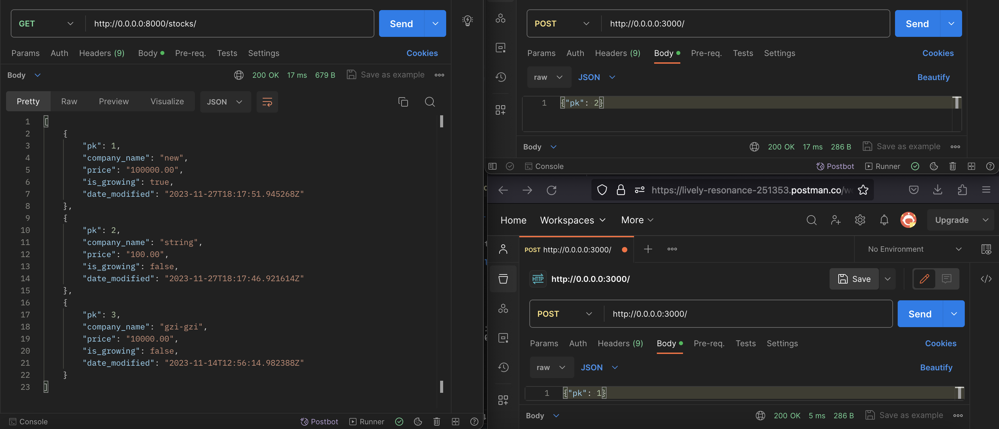

# Методические указания по выполнению лабораторной работы №8

## Задачи:
- Создать асинхронный сервис для выполнения долгой задачи
- Показать межсервисное взаимодействие между новым сервисом и сервисом из прошлых лабораторных

## Создание приложения на Django
В методических указаниях по [1 лабораторной](https://github.com/iu5git/Web/blob/main/tutorials/lab1-py/lab1_tutorial.md) описано, как из VS Code работать с удаленным проектом, расположенном на виртуальной машине.

Создадим приложение с испольхованием  DRF-фреймворка, как это делалось в [3](https://github.com/iu5git/Web/blob/main/tutorials/lab3-py/lab3_tutorial.md) и [5](https://github.com/iu5git/Web/blob/main/tutorials/lab5-py/README.md) лабораторных. Для этого в терминале VS Code:

1. Создаём и активируем виртуальную среду командами `python -m venv env` и `. env/bin/activate`. Устанавливаем зависимости командами `pip install Django==4.2.4` и `pip install djangorestframework`
2. Cоздаём проект lab8 с помощью команды `django-admin startproject lab8`. После выполнения этой команды в текущей директории будет создан каталаг lab8 с несколькими .py файлами, среди них settings.py.
3. Создадим приложение app с помощью команды `django-admin startapp app`
4. Применим все миграции проекта: `python manage.py migrate`
5. В файле `settings.py` в `ALLOWED_HOSTS` добавляем звездочку. `ALLOWED_HOSTS = ['*']`
В `INSTALLED_APPS` добавим название нашего приложения и модуль DRF (фреймворк для упрощения создания приложений с REST API):
    ```python
    INSTALLED_APPS = [
        'django.contrib.admin',
        'django.contrib.auth',
        'django.contrib.contenttypes',
        'django.contrib.sessions',
        'django.contrib.messages',
        'django.contrib.staticfiles',

        # DRF
        'rest_framework',

        # Наше приложение
        'app',
    ]
    ```
Также через терминал установим пакет requests:

`pip install requests`

## Синхронный веб-сервер
В этой лабораторной мы хотим показать межсерверное взаимодействие. Мы создадим новый веб-сервер, который будет принимать запросы с pk объекта из БД основного сервера из предыдущих работ. Затем новый веб-сервер "рассчитает" новое значение для какого-то поля этого объекта и отправит PUT-запрос к основному серверу. 

В примере мы будем случайно менять логическое поле `is_growing` объектов-акций. Функция для "расчётов" `get_random_status`:

```python
import random

def get_random_status():    
      return bool(random.getrandbits(1))
```

Для отправки PUT-запроса будем использовать модуль requests. Для синхронного сервера напишем функцию `send_status`:
```python
import requests

CALLBACK_URL = "http://0.0.0.0:8000/stocks/"

def send_status(pk, status):
        nurl = str(CALLBACK_URL+str(pk)+'/put/')
        answer = {"is_growing": status}
        requests.put(nurl, data=answer, timeout=3)
```
В Django-приложениях для обработки запросов используются view. В файле lab8/app/views.py добавим обработчик POST-метода `set_status`, который: 
- принимает запрос с полем "pk" 
- получает результат "расчётов" от `get_random_status`
- отправляет PUT-запрос к основному серверу с помощью `send_status`

```python
from rest_framework.decorators import api_view
from rest_framework.response import Response
from rest_framework import status

@api_view(['POST'])
def set_status(request):
    if "pk" in request.data.keys():   
        id = request.data["pk"]        
        stat = get_random_status()
        send_status(id,stat)              
        return Response(status=status.HTTP_200_OK)
    return Response(status=status.HTTP_400_BAD_REQUEST)
```
Также в Django-приложении необходимо связать view-обработчик и путь. В lab8/urls.py:

```python
from django.contrib import admin
from django.urls import path
from app import views

urlpatterns = [
    path('admin/', admin.site.urls),
    path(r'', views.set_status, name='set-status'),
]
```
Запустим приложение, введя в терминале: `python manage.py runserver 0.0.0.0:8000`

## Асинхронный веб-сервер 

Может так случиться, что дополнительный веб-сервер выполняет расчёты слишком долго. Это можно сымитировать с помощью time.sleep в `get_random_status` (и да, теперь мы возвращаем пару значений - статус и pk. это будет удобнее в дальнейшем)

```python
import random
import time

def get_random_status(pk):
    time.sleep(5)
    return {
      "id": pk,
      "status": bool(random.getrandbits(1)),
    }
```
В таком случае основной сервер будет слишком долго дожидаться ответа 200 OK и может быть даже зависнет-в-ожидании (если выполнял запрос к вспомогательному серверу в своём основном потоке, где обрабатывает и всё остальное).

Мы хотим, чтобы сервер быстро отвечал на запрос, а долгая задача get_random_status() запускалась "в фоновом режиме". `send_status` должна же отправлять PUT-запрос к основному серверу именно тогда, когда долгая задача `get_random_status` закончится.

Для запуска задач в фоновом режиме можно использовать `ThreadPoolExecutor` (Пул потоков) из `concurrent.futures`. Пул потоков обычно используют для распараллеливания задачи на потоки, но нам многопоточность не нужна (количество потоков max_workers=1). Помещение задачи `get_random_status` в пул выглядит как-то так: 

```python
from concurrent import futures

executor = futures.ThreadPoolExecutor(max_workers=1)

@api_view(['POST'])
def set_status(request):
	...
	task = executor.submit(get_random_status, id)
	...
	return Response(status=status.HTTP_200_OK)
```
Теперь наш обработчик POST-запроса запустит задачу get_random_status (с параметром id) в фоновом режиме и тут же продолжит выполнение (отправит ответ 200 OK основному серверу).

Затем необходимо добавить что-то, что будет следить за выполняемой в фоновом режиме "долгой" задачей - а затем отправлять её результат основному серверу. Это можно сделать с помощью так называемого колбэка.

Заменим функцию `send_status` коллбэком `status_callback` и привяжем его к задаче: 
```python
def status_callback(task):
    try:
      result = task.result()
    except futures._base.CancelledError:
      return
    
    nurl = str(CALLBACK_URL+str(result["id"])+'/put/')
    answer = {"is_growing": result["status"]}
    requests.put(nurl, data=answer, timeout=3)

@api_view(['POST'])
def set_status(request):
	...
        task = executor.submit(get_random_status, id)
        task.add_done_callback(status_callback)   
	
	return Response(status=status.HTTP_200_OK)
	...
```
Теперь всё готово. Приведу полный код views.py (urls.py остаётся таким же, как в части про синхронный сервер):

```python
from rest_framework.decorators import api_view
from rest_framework.response import Response
from rest_framework import status

import time
import random
import requests

from concurrent import futures

CALLBACK_URL = "http://0.0.0.0:8000/stocks/"

executor = futures.ThreadPoolExecutor(max_workers=1)

def get_random_status(pk):
    time.sleep(5)
    return {
      "id": pk,
      "status": bool(random.getrandbits(1)),
    }

def status_callback(task):
    try:
      result = task.result()
      print(result)
    except futures._base.CancelledError:
      return
    
    nurl = str(CALLBACK_URL+str(result["id"])+'/put/')
    answer = {"is_growing": result["status"]}
    requests.put(nurl, data=answer, timeout=3)

@api_view(['POST'])
def set_status(request):
    if "pk" in request.data.keys():   
        id = request.data["pk"]        

        task = executor.submit(get_random_status, id)
        task.add_done_callback(status_callback)        
        return Response(status=status.HTTP_200_OK)
    return Response(status=status.HTTP_400_BAD_REQUEST)
```
 
В python существует более высокоуровневый модуль для работы с асинхронными процессами - asyncio (с ним не нужно думать о ThreadPoolExecutor и колбэках), однако есть проблемы с совместимостью asyncio и DRF. 

## Тестирование

Проверим работу асинхронного сервера. Отправляем последовательно пару запросов, и нам спустя несколько миллисекунд приходят ответы со статусом 200. 
Спустя примерно 5 секунд данные на основном сервере из предыдущих лабораторных обновляются. 



